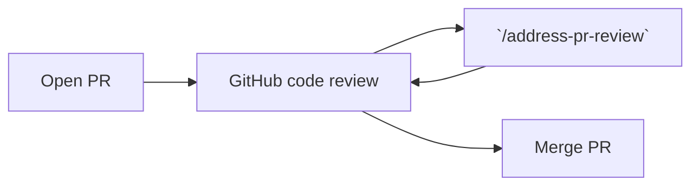

# Agent skills

## Address PR review

An agent skill that **reads pull request comments and CI failures and fixes them automatically**.

```bash
# install via https://skills.sh in the project
npx skills add mnapoli/skills@address-pr-review
# or install globally with `-g`
npx skills add -g mnapoli/skills@address-pr-review
```

Usage:

```
/address-pr-review
```

Your agent will:

- Fix CI failures
- Read inline PR comments (ignores resolved comments)
- Make code changes, push and reply to each thread




### Prerequisites

- [GitHub CLI](https://cli.github.com/) (`gh`) installed and authenticated
- [`jq`](https://jqlang.org/) (used by the CI check script)

### Tips

1. Run Claude Code's [code review in GitHub Actions](https://code.claude.com/docs/en/github-actions) for automatic reviews on every push
2. Run [Codex code review](https://developers.openai.com/codex/integrations/github/) as well
3. Review Claude and Codex's comments and "mark as resolved" those that don't make sense
4. Review the code yourself: open comments inline the PR diff
5. Launch `/address-pr-review` locally so that all comments are addressed
6. Repeat until the PR is ready to merge
