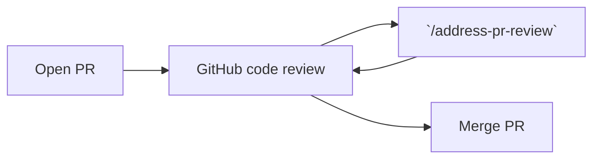
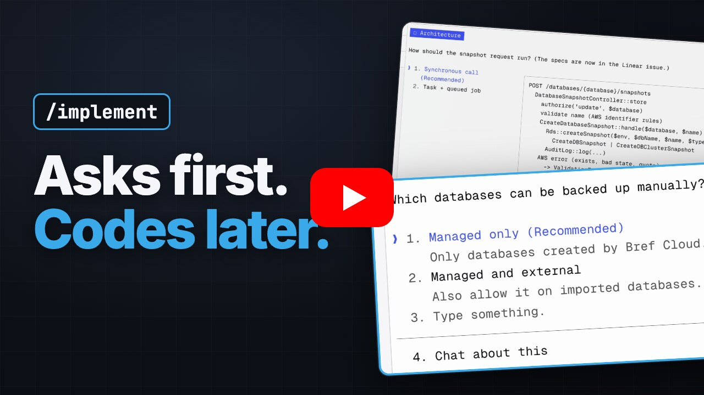

# Agent skills

- [Address PR review](#address-pr-review): fix CI failures and address PR review comments
- [Implement](#implement): implement a Linear issue end to end
- [Interview](#interview): get interviewed about a feature until there is a complete implementation plan
- [Tell Grok bot](#tell-grok-bot): send a message to your Grok bot agent, to delegate a task or pass on information
- [Unslop](#unslop): remove AI-sounding writing patterns from English or French text

## Address PR review

An agent skill that **reads pull request comments and CI failures and fixes them automatically**.

```bash
# install via https://skills.sh in the project
npx skills add mnapoli/skills/address-pr-review
# or install globally with `-g`
npx skills add -g mnapoli/skills/address-pr-review
```

Usage:

```
/address-pr-review
```

Your agent will:

- Fix CI failures
- Read inline PR comments (ignores resolved comments)
- Make code changes, push and reply to each thread




### Prerequisites

- [GitHub CLI](https://cli.github.com/) (`gh`) installed and authenticated
- [`jq`](https://jqlang.org/) (used by the CI check script)

### Tips

1. Run Claude Code's [code review in GitHub Actions](https://code.claude.com/docs/en/github-actions) for automatic reviews on every push
2. Run [Codex code review](https://developers.openai.com/codex/integrations/github/) as well
3. Review Claude and Codex's comments and "mark as resolved" those that don't make sense
4. Review the code yourself: open comments inline the PR diff
5. Launch `/address-pr-review` locally so that all comments are addressed
6. Repeat until the PR is ready to merge

## Implement

An agent skill that **implements a Linear issue end to end**: specs, design, code, tests and pull request.

<a href="https://www.youtube.com/watch?v=T6NXfxIcxno"></a>

```bash
# install via https://skills.sh in the project
npx skills add mnapoli/skills/implement
# or install globally with `-g`
npx skills add -g mnapoli/skills/implement
```

Usage:

```
/implement ENG-123
/implement https://linear.app/acme/issue/ENG-123/...
```

Your agent will:

- Fetch the issue, related issues and the project from Linear, and move the issue to "In Progress"
- Create a branch named after the issue
- Ask you questions one at a time until nothing is left unclear, then write the specs in the issue
- Go through the architecture with you, one decision at a time, before writing code
- Implement the change with tests, open a PR that references the issue, and monitor it
- Record unrelated problems it finds along the way as new Linear issues
- Finish with a short report of what needs your attention: decisions it made on its own, deviations from the specs, what it could not test

### Prerequisites

- [Linear MCP server](https://linear.app/docs/mcp) connected to your agent
- [GitHub CLI](https://cli.github.com/) (`gh`) installed and authenticated

## Interview

An agent skill that **interviews you about a feature until it has everything needed to write a complete implementation plan**.

```bash
# install via https://skills.sh in the project
npx skills add mnapoli/skills/interview
# or install globally with `-g`
npx skills add -g mnapoli/skills/interview
```

Usage:

```
/interview let users invite teammates to their organization
```

Your agent will:

- Explore the codebase and `docs/` for related features, patterns and domain concepts
- Interview you, starting with brainstorming and converging toward a plan: the problem, users, scope, edge cases, data model, UI/UX…
- Challenge your assumptions, and tell you explicitly when it settles a minor point itself so you can correct it
- Write the plan in the chat, in the language you used: summary, scope, product requirements and technical plan
- Wait for your go-ahead before implementing

## Tell Grok bot

An agent skill that lets any agent (Claude Code, Codex, Cursor…) **send a message to your Grok bot agent**, for example to delegate a task or pass on something to remember.

```bash
# install via https://skills.sh in the project
npx skills add mnapoli/skills/tell-grokbot
# or install globally with `-g`
npx skills add -g mnapoli/skills/tell-grokbot
```

Usage:

```
/tell-grokbot this feature shipped, plan a blog post about it
tell Grok bot that we now support PHP 8.5
```

Your agent will:

- Write a self-contained message (project, what happened, links), since Grok bot doesn't see the conversation
- Send it to a Grok bot routine through its webhook, then show you what it sent

The agent only sends messages when you ask it to.

### Setup

1. In Grok bot, create a routine with a webhook trigger. Its URL and Bearer key are in the routine's panel: open the agent's name at the top of the chat → Tasks → the routine → Webhook section.
2. On first use, the agent asks you for the URL and the key, and stores them in `~/.config/grokbot/webhook.env` (readable only by you).

What Grok bot does with the message is up to the routine's instruction.

### Prerequisites

- `curl`
- [`jq`](https://jqlang.org/)

## Unslop

Two agent skills that **detect and remove AI-sounding writing patterns** ("slop") from text, then rewrite it with a genuine human voice. Inspired by [Cursor's unslop skill](https://github.com/cursor/plugins/blob/main/pstack/skills/unslop/SKILL.md).

- [`unslop`](./unslop/SKILL.md) — for English text
- [`unslop-fr`](./unslop-fr/SKILL.md) — for French text

```bash
npx skills add -g mnapoli/skills/unslop
npx skills add -g mnapoli/skills/unslop-fr
```

Usage:

```
/unslop README.md
unslop your previous response
unslop your responses
```

### Example

Before:

> The reviewer's comment is not only right — it points at something deeper. The `retry` flag isn't just a configuration option; it's load-bearing: the scheduler, the plugin API, and the CI integration all rely on it to decide whether a failed task should propagate. Removing it would mean threading an explicit policy through three call sites, and that's the whole cost — no schema change, no migration. That said, keeping it as-is is also defensible: the current behavior is battle-tested, and the ambiguity only surfaces in edge cases. Ultimately, the right move depends on how much you value explicitness over backward compatibility.

After:

> The reviewer is right. The `retry` flag is not a plain configuration option: the scheduler, the plugin API, and the CI integration all read it to decide whether a failed task propagates. Removing it means changing those three call sites, with no schema change and no migration. The current behavior works and the ambiguity only shows up in edge cases, so I recommend keeping the flag and documenting the propagation rule.
