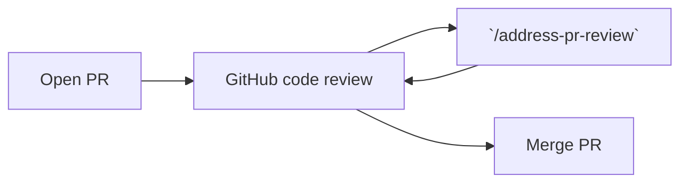
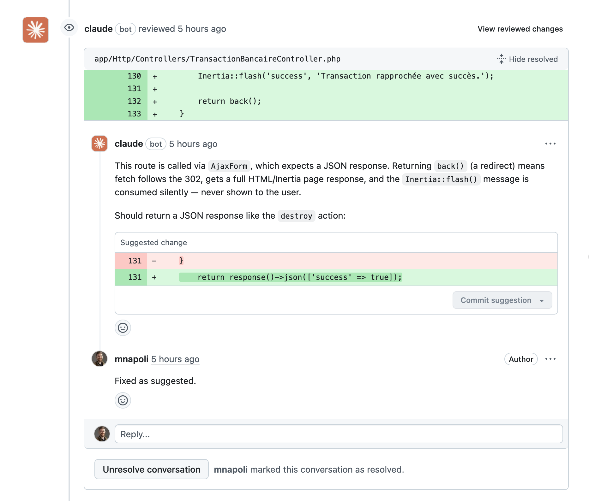

# Agent skills

## Unslop

Two agent skills that **detect and remove AI-sounding writing patterns** ("slop") from text, then rewrite it with a genuine human voice. Inspired by [Cursor's unslop skill](https://github.com/cursor/plugins/blob/main/pstack/skills/unslop/SKILL.md).

Both skills refine the original on two points: structural bold is allowed (only scattered emphasis bold is removed), and short natural sentences are preferred over telegraphic fragments.

- [`unslop`](./unslop/SKILL.md) — for English text
- [`unslop-fr`](./unslop-fr/SKILL.md) — for French text, with French-specific adaptations: a French AI-vocabulary list, and French typography preserved (guillemets, espaces insécables, no Title Case rule)

```bash
npx skills add -g mnapoli/skills/unslop
npx skills add -g mnapoli/skills/unslop-fr
```

Usage:

```
/unslop <file or text>
/unslop-fr <file or text>
```

## Address PR review

An agent skill that **reads pull request comments and CI failures and fixes them automatically**.

```bash
# install via https://skills.sh in the project
npx skills add mnapoli/skills/address-pr-review
# or install globally with `-g`
npx skills add -g mnapoli/skills/address-pr-review
```

Usage:

```
/address-pr-review
```

Your agent will:

- Fix CI failures
- Read inline PR comments (ignores resolved comments)
- Make code changes, push and reply to each thread





### Prerequisites

- [GitHub CLI](https://cli.github.com/) (`gh`) installed and authenticated
- [`jq`](https://jqlang.org/) (used by the CI check script)

### Tips

1. Run Claude Code's [code review in GitHub Actions](https://code.claude.com/docs/en/github-actions) for automatic reviews on every push
2. Run [Codex code review](https://developers.openai.com/codex/integrations/github/) as well
3. Review Claude and Codex's comments and "mark as resolved" those that don't make sense
4. Review the code yourself: open comments inline the PR diff
5. Launch `/address-pr-review` locally so that all comments are addressed
6. Repeat until the PR is ready to merge
